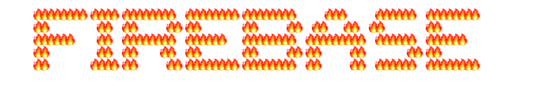

# Restoration Station


[Visit the site!](https://restoration-station.firebaseapp.com)

Restoration Station can be an organization committed to watershed and ecosystem-wide restoration. This site is a great resource for members of all roles to see and share progress and get connected with other members in our organization. With authenticated^ google sign in for admins, full control has never been easier to add, edit and delete members as necessary. You don't need to be an admin to get in on the fun though, all users have access to their profiles to update and show off their great work!

^Authentication is not fully handled at this time, and a few bugs persist at the time of writing. Placeholder credentials are 'g@g.com' and '123456' for email and password fields respectively if you'd like to experience what is near the intended functionality.

This project was generated with [Angular CLI](https://github.com/angular/angular-cli) version 1.1.2.

## By Grady Shelton

## User Stories

* As a user, I'd like to visit a page to see a list of all team or club members.
* As a user, I'd like to click on a club member's entry in the list to visit their profile page, which should include more details about them.
* As a user, I'd like the option to visit an "About" page that explains what the club is, and what they do.
* As a user, I'd like all data persisted in a database, so it's always there when I need it.
* As a user, I'd like to filter the list of users by their particular role in the group, and by their location.
* As an administrator, I want to add new users to the club.
* As an administrator, I want to edit user profiles, in case I make a mistake, or need to update their details.
* As an administrator, need the option to delete a user, in case they leave the club or team.

## Screenshots

Admin Account


Member Profile


Forms


## Prerequisites

You will need the following things properly installed on your computer.

* [Git](https://git-scm.com/)
* [Node.js](https://nodejs.org/) (with NPM)
* [AngularCLI](https://cli.angular.io/)
* 

## Installation

If you would like to clone and run this site locally:

* `git clone https://github.com/gravytates/restoration-station.git`
* `cd restoration-station`
* `npm install`
* `bower install bootstrap --save`

## Firebase Integration

* Create a firebase account at `https://firebase.google.com`
* Add a new project to your firebase account
* Create a file in the app folder labeled api-keys.ts
* Add the following to your api-keys file:

```
export var masterFirebaseConfig = {
    apiKey: "xxxx",
    authDomain: "xxxx.firebaseapp.com",
    databaseURL: "https://xxxx.firebaseio.com",
    storageBucket: "xxxx.appspot.com",
    messagingSenderId: "xxxx"
  };
```
* In firebase, consider changing your rules for read/write to true and true, re-importing the members.json file to apply seeded data, and setting up an authorized user email and password to take advantage of the site's admin functionality.


## Development server

Run `ng serve` for a dev server. Navigate to `http://localhost:4200/`. The app will automatically reload if you change any of the source files.

## Code scaffolding

Run `ng generate component component-name` to generate a new component. You can also use `ng generate directive|pipe|service|class|module`.

## Build

Run `ng build` to build the project. The build artifacts will be stored in the `dist/` directory. Use the `-prod` flag for a production build.

## Running unit tests

Run `ng test` to execute the unit tests via [Karma](https://karma-runner.github.io).

## Running end-to-end tests

Run `ng e2e` to execute the end-to-end tests via [Protractor](http://www.protractortest.org/).
Before running the tests make sure you are serving the app via `ng serve`.

## Further help

To get more help on the Angular CLI use `ng help` or go check out the [Angular CLI README](https://github.com/angular/angular-cli/blob/master/README.md).

## Authors

* Grady Shelton

## Contact

Please feel free to contact me, Grady Shelton, at gradyish@gmail.com if you have any questions, concerns or suggestions regarding this repository. Improving every day is my primary goal, so I encourage you to reach out if you have any feedback you'd like to share!

## License

MIT License

Copyright (c) Grady Shelton

Permission is hereby granted, free of charge, to any person obtaining a copy
of this software and associated documentation files (the "Software"), to deal
in the Software without restriction, including without limitation the rights
to use, copy, modify, merge, publish, distribute, sublicense, and/or sell
copies of the Software, and to permit persons to whom the Software is
furnished to do so, subject to the following conditions:

The above copyright notice and this permission notice shall be included in all
copies or substantial portions of the Software.

THE SOFTWARE IS PROVIDED "AS IS", WITHOUT WARRANTY OF ANY KIND, EXPRESS OR
IMPLIED, INCLUDING BUT NOT LIMITED TO THE WARRANTIES OF MERCHANTABILITY,
FITNESS FOR A PARTICULAR PURPOSE AND NON-INFRINGEMENT. IN NO EVENT SHALL THE
AUTHORS OR COPYRIGHT HOLDERS BE LIABLE FOR ANY CLAIM, DAMAGES OR OTHER
LIABILITY, WHETHER IN AN ACTION OF CONTRACT, TORT OR OTHERWISE, ARISING FROM,
OUT OF OR IN CONNECTION WITH THE SOFTWARE OR THE USE OR OTHER DEALINGS IN THE
SOFTWARE.
